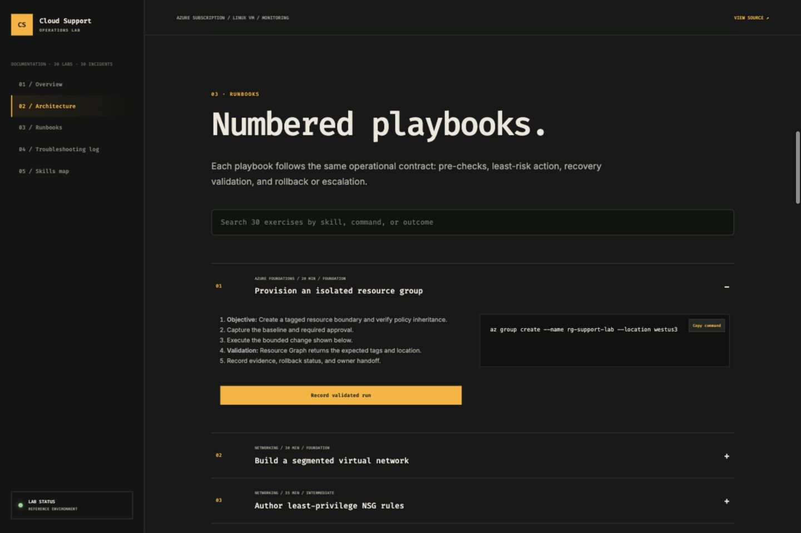
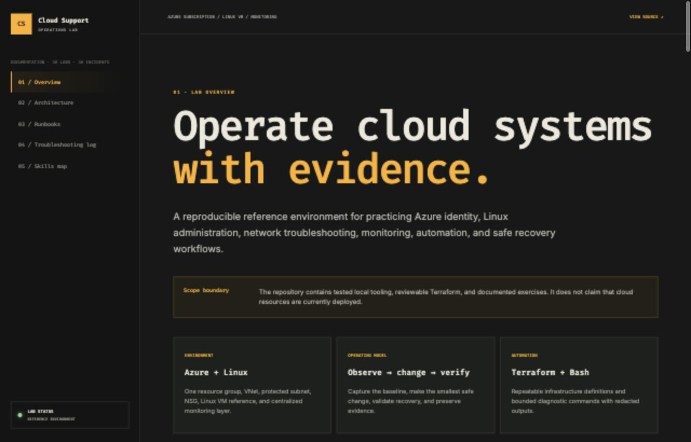

# Cloud Support Operations Lab

> An Azure and Linux support lab for repeatable diagnostics, evidence capture, escalation, recovery validation, and operational documentation.

**[Open the live operations dashboard](https://paulrevanthpersonal-lab.github.io/cloud-ops-lab/)**



## 1. Overview

This repository implements a repeatable cloud-support practice environment. It combines 30 guided exercises, 30 incident records, a searchable operations dashboard, persisted validation runs, a redacting diagnostic CLI, Azure Terraform, Docker delivery, incident templates, and automated checks.

## 2. Operational goals

- Reduce guesswork during access, DNS, network, permission, deployment, logging, and cost incidents
- Capture enough evidence for reliable engineering handoffs
- Prefer reversible actions and least privilege
- Define escalation and recovery verification before making changes

## 3. Lab scenarios

The catalog contains 30 guided exercises spanning identity, Linux, DNS, TCP/IP, Azure networking, IAM/RBAC, storage, Docker, Terraform, monitoring, incident management, backup, and recovery. A separate 30-record incident library captures symptoms, root cause, safe fix, and recovery verification.

## 4. Experience design

The dashboard uses a tactile editorial-and-terminal visual system that is deliberately different from a typical SaaS admin page. It is responsive, keyboard accessible, and motion-reduced when requested by the operating system.



## 5. Architecture

See [docs/ARCHITECTURE.md](docs/ARCHITECTURE.md) for the relationship among the browser workspace, Python API, SQLite run history, diagnostics, Terraform, logging, and alerts.

## 6. Repository components

| Component | Purpose |
|---|---|
| `dashboard/` | Searchable operator experience |
| `data/labs.json` | 30 exercises and 30 resolved incident patterns |
| `server.py` | Standard-library API, validation-run persistence, and static delivery |
| `runbooks/` | Symptom-driven support procedures |
| `scripts/diagnose.sh` | DNS, TCP, HTTP, and route evidence |
| `infra/` | Azure Log Analytics and action-group lab |
| `docs/` | Architecture, security, and incident templates |

## 7. Quick start

Run with Python or Docker:

```bash
python3 server.py
# or
docker compose up
```

Then visit `http://localhost:8080`.

## 8. Diagnostic CLI

```bash
./scripts/diagnose.sh dns example.com
./scripts/diagnose.sh tcp example.com 443
./scripts/diagnose.sh http https://example.com/health
./scripts/diagnose.sh route example.com
```

The tool redacts IPv4 addresses and writes a SHA-256 hash beside the evidence file.

## 9. Azure infrastructure

```bash
cd infra
terraform init
terraform plan
```

The configuration creates an isolated resource group, Log Analytics workspace, and operations action group. It does not deploy unless the operator explicitly runs `terraform apply` with an authenticated Azure account.

## 10. Runbook standard

Every guided exercise includes objective, environment, commands, verification, rollback, and evidence requirements. The deeper operational runbooks include scope, safe workflow, escalation triggers, and recovery verification.

## 11. Evidence handling

Use [the incident template](docs/INCIDENT_TEMPLATE.md) to record user impact, timeline, changes, diagnostic output, decisions, approvals, and verified recovery.

## 12. Automated screenshots

```bash
bash scripts/capture_screenshots.sh
```

Headless Chrome writes desktop and mobile evidence under `docs/screenshots/`.

## 13. Validation and CI

GitHub Actions checks all 60 data records, Python unit tests, JavaScript syntax, Terraform formatting, Bash syntax, required runbook coverage, and security documentation on each push and pull request.

## 14. Security model

The lab never stores credentials and never automates destructive recovery. Read [docs/SECURITY.md](docs/SECURITY.md) before running diagnostics against any environment.

## 15. Interview discussion points

- How to distinguish authentication, authorization, network, and guest-OS access failures
- Why evidence is redacted and hashed
- How to choose rollback versus forward remediation
- Why cost controls and tagging belong in support operations
- How recovery verification differs from “the error disappeared”

## 16. Roadmap

- Add OpenTelemetry evidence collection
- Add Azure Policy and budget modules
- Add packet-loss and TLS certificate modes
- Export evidence bundles as signed archives
- Export a selected lab run as a signed evidence bundle

## 17. Status and limitations

This is a safe portfolio lab. Terraform is intentionally small, diagnostic scope is operator-controlled, and no production credentials or client data are included.

## 18. License

Released under the [MIT License](LICENSE).
