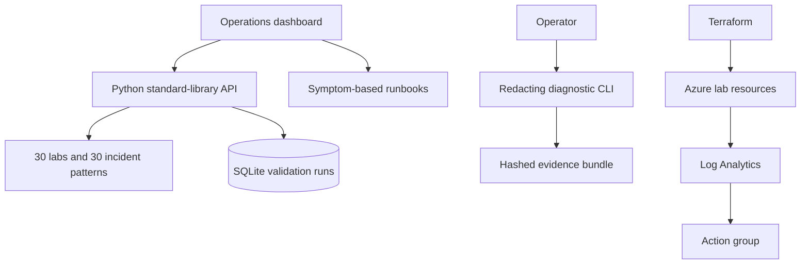

# Architecture

The lab separates presentation, immutable practice content, persisted validation evidence, safe diagnostic collection, runbook decisions, and infrastructure. The dashboard can read the versioned catalog directly on GitHub Pages; running `server.py` adds API filtering and SQLite-backed run records. Real credentials and production endpoints are intentionally excluded.
