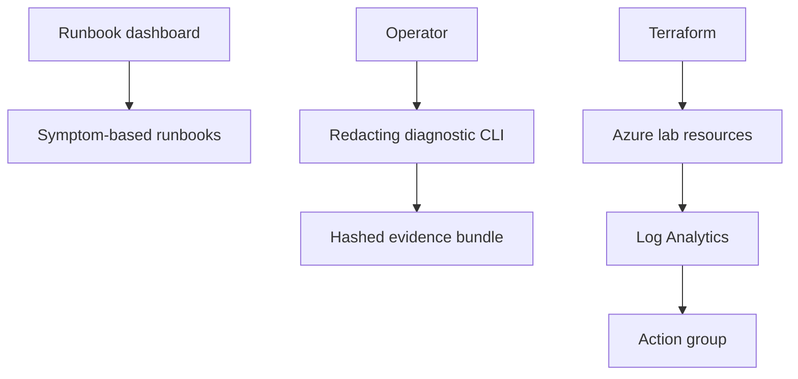

# Architecture

```mermaid
flowchart TB
  UI[Runbook dashboard] --> DOCS[Symptom-based runbooks]
  OPS[Operator] --> CLI[Redacting diagnostic CLI]
  CLI --> EVIDENCE[Hashed evidence bundle]
  TF[Terraform] --> AZURE[Azure lab resources]
  AZURE --> LOGS[Log Analytics]
  LOGS --> ALERTS[Action group]
```

The lab separates presentation, safe diagnostic collection, runbook decisions, and infrastructure. Real credentials and production endpoints are intentionally excluded.

